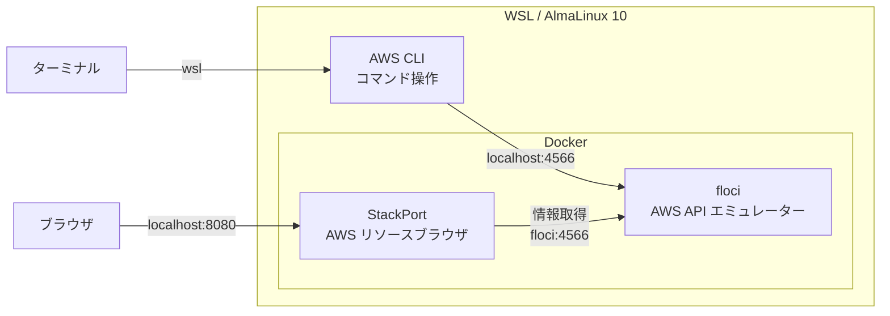
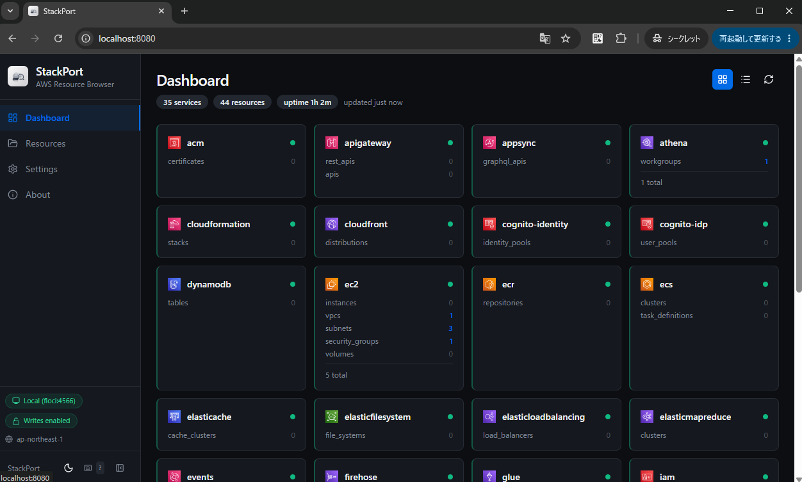

# wsl_aws_cli_study1

## 概要

* WSL で ローカル AWS エミュレーター環境を構築する
* コマンド一発で環境が構築できる
* 本物の AWS を使わずに AWS CLI を気軽に試せる 
* ブラウザから AWS リソースの状態が確認できる



## 参照

floci  
https://github.com/floci-io/floci  
ポップコーンそっくりの雲の形をした雲、フロッカスにちなんで名付けられた。
無料のオープンソースのローカルAWSエミュレーター。アカウント不要。機能制限なし。ただ docker compose up。

StackPort  
https://github.com/DaviReisVieira/stackport  
ローカルエミュレータ（LocalStackなど）および実際の AWS アカウントに対応した、汎用 AWS リソースブラウザです。
S3、DynamoDB、Lambda、SQS、IAM、EC2、CloudWatch Logs、Secrets Manager などの主要サービス向けの専用UIを搭載し、計 35 種類の AWS サービスの閲覧・検査・管理が可能です。

## 注意事項

AWS エミュレーターは完璧ではありません。  
非対応の機能があります。
また、開発途上のため不具合の可能性もあります。


## 詳細

### 目次
* 環境構築
* 起動
* 削除
* 環境確認
* StackPort で AWS モックの状態を GUI から確認
* AWS CLI で S3 バケットを操作

### 環境構築
```
$n="AWS-CLI-Study"; wsl --install AlmaLinux-10 --name $n --no-launch; wsl -u root -d $n -- ./setup.sh; wsl -t $n
```

### 起動
```
$n="AWS-CLI-Study"; wsl -d $n
```

### 削除
```
$n="AWS-CLI-Study"; wsl --unregister $n
```

### 環境確認

#### AWS CLI のバージョン
```
aws --version
```
出力例
```
aws-cli/2.34.62 Python/3.14.5 Linux/6.6.87.2-microsoft-standard-WSL2 exe/x86_64.almalinux.10
```

#### AWS モックへの認証確認
```
aws sts get-caller-identity
```
出力例
```
{
    "UserId": "000000000000",
    "Account": "000000000000",
    "Arn": "arn:aws:iam::000000000000:root"
}
```

#### AWS モックの状態確認
```
docker ps
```
出力例
```
CONTAINER ID   IMAGE                      COMMAND                  CREATED          STATUS                   PORTS                                         NAMES
0797df83d05b   davireis/stackport:0.3.4   "python -m backend.m…"   12 minutes ago   Up 3 minutes (healthy)   0.0.0.0:8080->8080/tcp, [::]:8080->8080/tcp   wsl_aws_cli_study1-stackport-1
4a7f8db7ba77   floci/floci:1.5.22         "/usr/local/bin/dock…"   12 minutes ago   Up 3 minutes (healthy)   0.0.0.0:4566->4566/tcp, [::]:4566->4566/tcp   wsl_aws_cli_study1-floci-1
```

### StackPort で AWS モックの状態を GUI から確認

以下にアクセス  
※最初の読み込みに数分かかるので表示されるまで気長に待つ  

http://localhost:8080



### AWS CLI で S3 バケットを操作

[docs/S3.md](docs/S3.md)