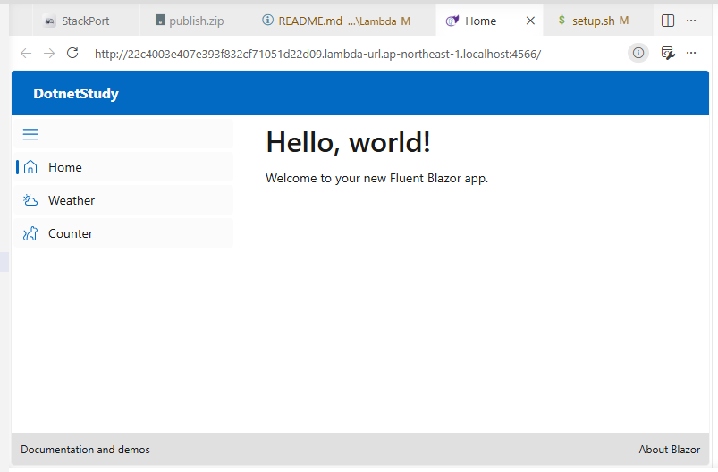

# Lambda

## スクリプトを zip に固める
```
(
cd ./samples/Lambda
zip function.zip index.mjs
)
```

## IAM ロールを作成

```
(
cd ./samples/Lambda
aws iam create-role \
    --role-name lambda-hello-role \
    --assume-role-policy-document file://trust-policy.json
)
```

## CloudWatch Logs へ出力できる基本権限を付与

```
aws iam attach-role-policy \
  --role-name lambda-hello-role \
  --policy-arn arn:aws:iam::aws:policy/service-role/AWSLambdaBasicExecutionRole
```

## ロール ARN を取得

```
ROLE_ARN=$(aws iam get-role \
  --role-name lambda-hello-role \
  --query 'Role.Arn' \
  --output text)

echo "$ROLE_ARN"
```

## Lambda 関数を作成

```
(
cd ./samples/Lambda
aws lambda create-function \
  --function-name hello-world-lambda \
  --runtime nodejs24.x \
  --role "$ROLE_ARN" \
  --handler index.handler \
  --zip-file fileb://function.zip \
  --architectures x86_64
)
```

## 実行テスト

※初回実行時は実行が完了するまでに少し時間がかかります。（恐らくイメージのダウンロード）

```
aws lambda invoke \
  --function-name hello-world-lambda \
  --payload '{}' \
  /dev/fd/3 \
  3>&1 1>/dev/null && echo
```

## Lambda Function URL を有効にする

```
aws lambda create-function-url-config \
  --function-name hello-world-lambda \
  --auth-type NONE
```

## Lambda Function URL の情報を取得する

```
aws lambda get-function-url-config \
  --function-name hello-world-lambda
```

## コードの更新

```
(
cd ./samples/Lambda
aws lambda update-function-code \
  --function-name hello-world-lambda \
  --zip-file fileb://function.zip
)
```

## .NET 10 の場合

publish.zip のソース  
https://github.com/Tobotobo/aws_lambda_dotnet_blazor_study1    


※事前に「IAM ロールを作成」と「ロール ARN を取得」を実行する

```
(
cd ./samples/Lambda
aws lambda create-function \
  --function-name dotnet-blazor-lambda \
  --runtime dotnet10 \
  --role "$ROLE_ARN" \
  --handler DotnetStudy \
  --zip-file fileb://publish.zip \
  --architectures x86_64
)
```

Function URLs
```bash
aws lambda create-function-url-config \
  --function-name dotnet-blazor-lambda \
  --auth-type NONE
```

Fuction URLs の URL を取得
```bash
aws lambda get-function-url-config \
  --function-name dotnet-blazor-lambda \
  --query 'FunctionUrl' \
  --output text
```

URL にアクセス



ソース更新
```bash
(
cd ./samples/Lambda
aws lambda update-function-code \
  --function-name dotnet-blazor-lambda \
  --zip-file fileb://publish.zip
)
```