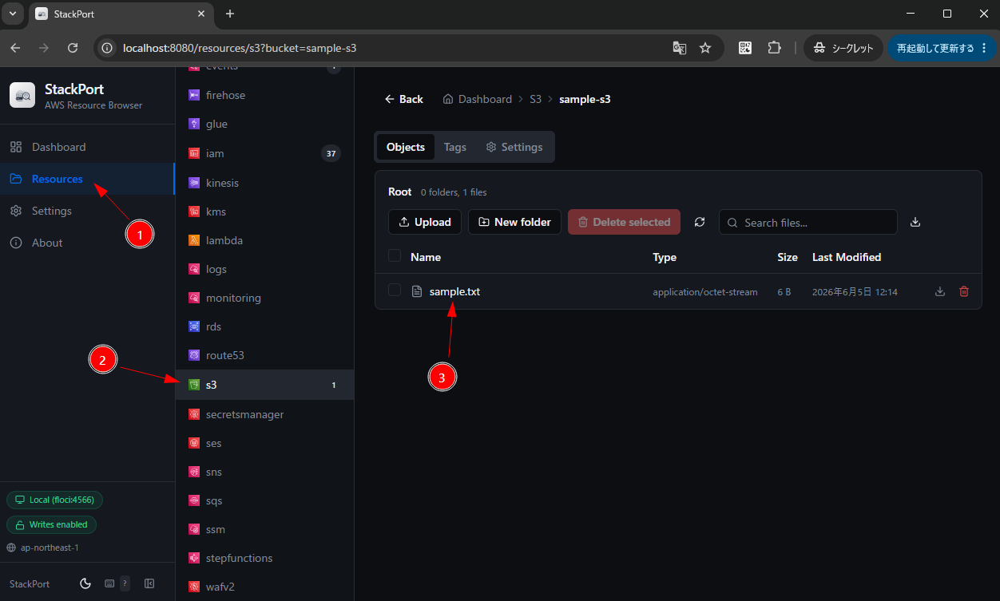

# S3

## バケット作成

```
aws s3 mb s3://sample-s3
```

## バケット一覧

```
aws s3 ls
```

## アップロード

```
aws s3 cp ./sample.txt s3://sample-s3/
```

## ダウンロード

```
aws s3 cp s3://sample-s3/sample.txt ./sample2.txt
```

## StackPort による GUI での確認




## ファイル削除

```
aws s3 rm s3://sample-s3/sample.txt
```

## バケット削除

```
aws s3 rb s3://sample-s3
```